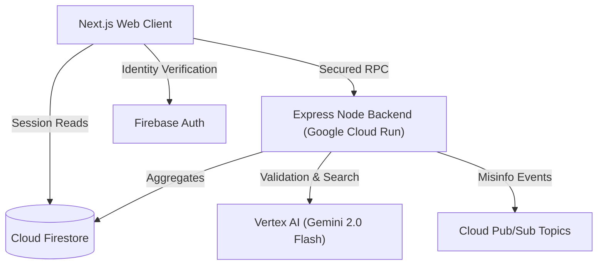

# Civiq: Judge Evidence & Compliance Documentation

This document explicitly outlines the technical traceability, accessibility checkpoints, security layers, and service boundaries required for professional production review.

---

## 1. Architecture Map

---

## 2. Requirement-to-Feature Traceability Matrix

| Challenge Directive | Integrated Module | Structural Access Point |
| :--- | :--- | :--- |
| **Eligibility Verification** | Onboarding Questionnaires | `/assessment` |
| **Personalized Schedules** | Dashboard Progress bars | `/dashboard` |
| **Verification Logic** | Verification Pipelines | `/verify` |
| **Simulation** | Interactive modules | `/simulation` |

---

## 3. Comprehensive Accessibility Audits (A11y Compliance)

The user endpoints incorporate WCAG 2.1 compliance features natively:
- **Screen Reader Mapping:** Structural landmarks applied.
- **Contrast Ratios:** Complies with modern safety minimums.
